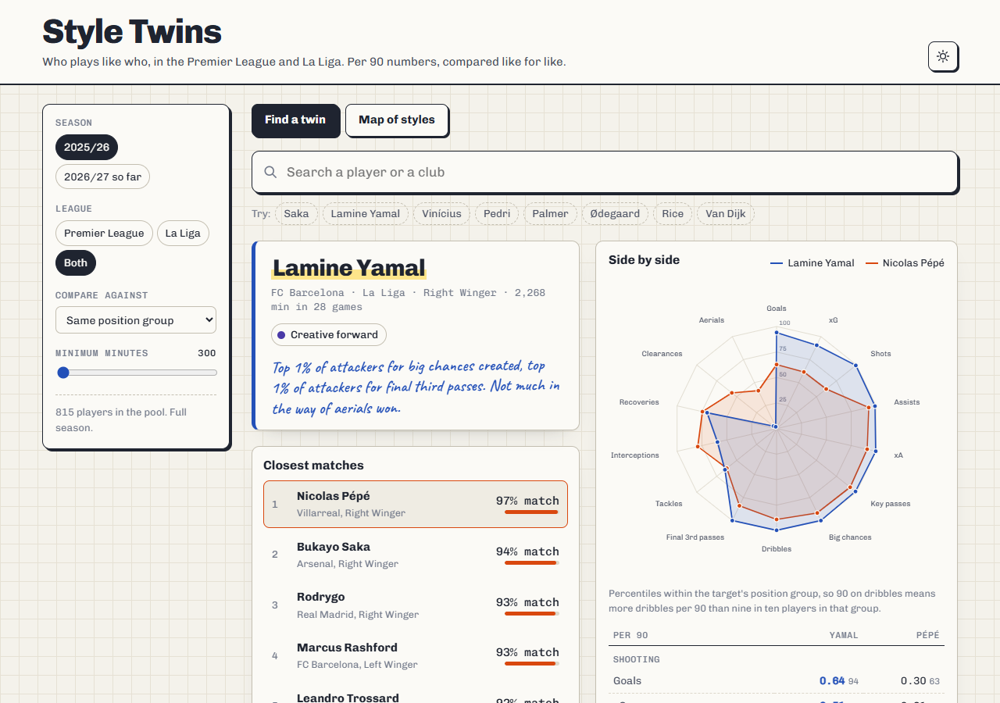
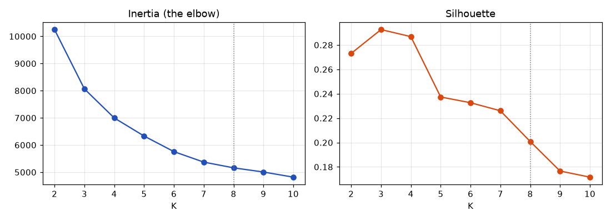
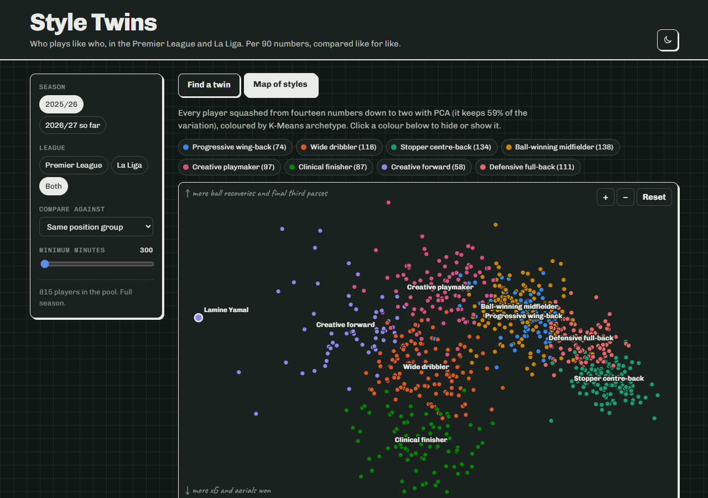

# player-similarity-scout

Who plays like who? This takes every outfield player with 300+ minutes in the Premier League and La Liga, turns their season into fourteen per 90 numbers, and finds each player's closest statistical twins. It also sorts everyone into eight playing styles with K-Means and draws the whole lot on a map.

I called the site Style Twins. Search a player, get their five closest matches with a percentage, and overlay any of them on a radar. There's a second tab with the map of styles and a card for each archetype.



## Some twins it found

All from 2025/26, same position group, both leagues:

| Player | Closest matches |
|---|---|
| Lamine Yamal | Nicolas Pépé 97%, Bukayo Saka 94%, Rodrygo 93%, Marcus Rashford 93% |
| Pedri | Dominik Szoboszlai 89%, Federico Valverde 88%, Martin Ødegaard 87%, Frenkie de Jong 86% |
| Cole Palmer | Morgan Gibbs-White 86%, Eberechi Eze 85%, Tijjani Reijnders 83% |
| Virgil van Dijk | Daniel Ballard 89%, Ibrahima Konaté 89%, James Tarkowski 88% |
| Erling Haaland (La Liga only) | Robert Lewandowski 96%, Etta Eyong 96%, Cédric Bakambu 96% |

Yamal's twin being Pépé says a lot about what cosine similarity measures. It compares the shape of a profile, not its size: Pépé does the same things in the same proportions (dribbles, final third passes, chances created, not much defending) but less of all of them. The radar makes that obvious, same outline, smaller. So these are twins in style, not in quality.

## How it works

**Data.** Season totals from Sofascore for both leagues, 2025/26 in full plus 2026/27 so far. Every counting stat is divided by minutes and scaled to 90, so a rotation player and an ever-present can be compared, and anyone under 300 minutes is dropped. The fourteen numbers: goals, xG, shots, assists, xA, key passes, big chances created, successful dribbles, final third passes, tackles won, interceptions, ball recoveries, clearances, aerial duels won.

Two of those are stand-ins. Progressive carries and shot creating actions aren't in any free source any more (FBref lost its Opta data in January 2026), so final third passes and big chances created take their places. The site says so wherever they show up.

**Positions.** Sofascore's position groups are too rough: they put Yamal and Palmer in midfield and Saka up front. Positions come from the [transfermarkt-datasets](https://github.com/dcaribou/transfermarkt-datasets) snapshot instead (Right Winger, Attacking Midfield, Centre-Back...), matched by name, and grouped into attackers, midfielders and defenders. 805 of 815 matched. The rest keep Sofascore's group.

**Similarity.** `StandardScaler` over the per 90s (fitted on 2025/26, with z-scores clipped at 3.5 so a freak number from a short spell can't dominate), then cosine similarity. By default a player is only compared with their own position group, because a winger's tackle count and a centre-back's tackle count mean different things.

**Archetypes.** K-Means with K=8. Straight K-Means on the style numbers kept lumping full-backs in with holding midfielders (they both tackle a lot), so the position group is appended as a weighted one-hot before clustering. Silhouette scores for K from 5 to 8 were 0.24, 0.23, 0.23 and 0.20, which is pretty flat, so eight was my call: at eight the extra groups are real roles (progressive wing-backs, creative forwards) rather than noise. Over a wider range the silhouette actually peaks at three, but three clusters is just attackers, midfielders and defenders again, which isn't telling anyone anything.



Names come from matching each cluster centre against hand-written templates, not from me eyeballing them:

| Archetype | Size | Closest to the middle of the group (900+ minutes) |
|---|---|---|
| Clinical finisher | 87 | Akor Adams, Ollie Watkins, Gorka Guruzeta |
| Creative forward | 58 | Nicolas Pépé, Bukayo Saka, Alejandro Garnacho |
| Wide dribbler | 116 | Jaidon Anthony, Crysencio Summerville, Diego López |
| Creative playmaker | 97 | Pablo Torre, Kiernan Dewsbury-Hall, Carles Aleñá |
| Ball-winning midfielder | 138 | Ibrahim Sangaré, Marc Roca, Sander Berge |
| Progressive wing-back | 74 | Thierry Correia, Marc Cucurella, Diogo Dalot |
| Defensive full-back | 111 | Lutsharel Geertruida, Jorrel Hato, Víctor Chust |
| Stopper centre-back | 134 | Vitor Reis, Aymeric Laporte, Alejandro Catena |

**Map.** PCA down to two dimensions, which keeps 59% of the variation. Left to right is roughly shooting and creating to clearing and intercepting, bottom to top is xG and aerials to recoveries and final third passes.

This season's players are pushed through last season's scaler, clusters and PCA, so an archetype means the same thing in both seasons.



## Things to keep in mind

- Per 90 numbers flatter players with few minutes, even above 300. The minutes slider is there for that.
- Stats come from a team as much as a player. A full-back at a side that has the ball all game will look more progressive than the same player at a relegation side.
- Early in a season, 2026/27 numbers are based on four or five games. Treat them as a rough sketch.
- Radar percentiles are within the target's position group, for both players, so the two shapes are on the same scale.

## Running it

```bash
python -m venv .venv
.venv\Scripts\activate          # or: source .venv/bin/activate
pip install -r requirements.txt

python data_loader.py           # fetch and build per 90 tables (live season refetched)
python similarity_engine.py     # scaler, cosine similarity, K-Means, PCA
python export_web.py            # JSON for the site into web/data/
python -m pytest                # includes a check that the browser's search matches python's

python -m http.server 8000 --directory web
```

## Deploying and keeping it fresh

The site is static, so on Vercel it's import and deploy: `vercel.json` points at `web/` with no build step, and `.vercelignore` keeps the Python side out of the upload.

`refresh.py` refetches the current season, reruns everything and pushes if anything changed, which makes Vercel redeploy. Sofascore blocks GitHub's servers, so rather than GitHub Actions it runs weekly from a Windows scheduled task:

```powershell
$action = New-ScheduledTaskAction -Execute "$PWD\.venv\Scripts\pythonw.exe" -Argument "refresh.py" -WorkingDirectory $PWD
$trigger = New-ScheduledTaskTrigger -Weekly -DaysOfWeek Tuesday -At 9:30am
$settings = New-ScheduledTaskSettingsSet -StartWhenAvailable
Register-ScheduledTask -TaskName "player-similarity-scout refresh" -Action $action -Trigger $trigger -Settings $settings
```

## Layout

```
data_loader.py        Sofascore season stats, per 90s
roles.py              positions from Transfermarkt, cached in data/processed/positions.csv
similarity_engine.py  scaler, similarity, archetypes, PCA
export_web.py         JSON for the site
refresh.py            the whole pipeline plus commit and push, for the scheduled task
web/                  the site (plain HTML, CSS and JS modules)
```
